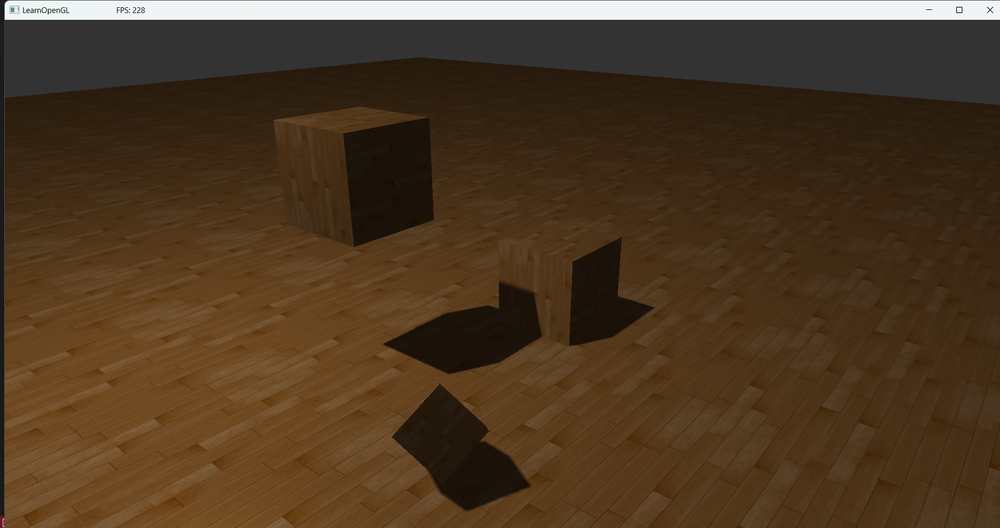

# LearnOpenGL_PDF
LearnOpenGL_PDF is a comprehensive repository showcasing a wide range of OpenGL techniques and effects. Each demo in this project is accompanied by a screenshot, so you can quickly preview the visual results without needing to open the files.

Below is the (In-Progresss) list of screenshots available in this repository:

1. **AlphaBlendDiscard-Grass**  
   

2. **BlinnPhongLighting**  
   

3. **Cubemap Reflection & Refraction**  
   

4. **Cubemap Skybox**  
   

5. **DifferentColorLights**  
   

6. **Framebuffers PP Effects**  
   

7. **Gamma Correction**  
   

8. **GeometryShader Advanced Explosion**  
   

9. **GeometryShader Advanced Normals Rendering**  
   

10. **GeometryShader Basics**  
    

11. **HDR**  
    

12. **Instancing Asteroids**  
    

13. **Instancing Basic**  
    

14. **Model Loading**  
    

15. **Multiple Lights**  
    

16. **NomralMapping Wall**  
    

17. **Normal Mapping**  
    

18. **ParallaxMapping Basic**  
    

19. **ParallaxMapping Occlusion Best**  
    

20. **ParallaxMapping Steep**  
    

21. **Phong Lighting**  
    

22. **Point Light**  
    

23. **Semi-transparency Windows**  
    

24. **Shadow Mapping**  
    

25. **Shadow Mapping PointShadows**  
    

26. **Soft SpotLight**  
    

27. **Spot Light**  
    